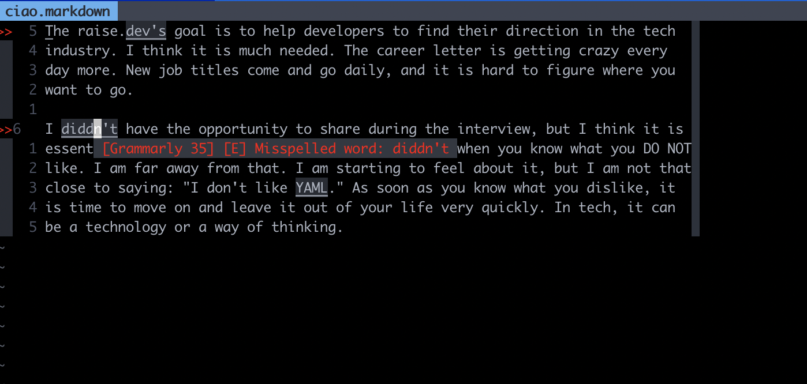

# coc-grammarly

coc-grammarly uses [grammary](https://github.com/znck/grammarly) and
it acts as a bridge between [Grammarly](https://www.grammarly.com/) and vim.

Currently I have a problem releasing my code because of this issue
[znck/grammarly/#138](https://github.com/znck/grammarly/issues/138) I think.

## Install

<!--`:CocInstall coc-grammarly`-->

## Keymaps

<!--`nmap <silent> <C-l> <Plug>(coc-coc-grammarly-keymap)`-->

## Lists

<!--`:CocList demo_list`-->

## License

MIT

---

> This extension is created by [create-coc-extension](https://github.com/fannheyward/create-coc-extension)
